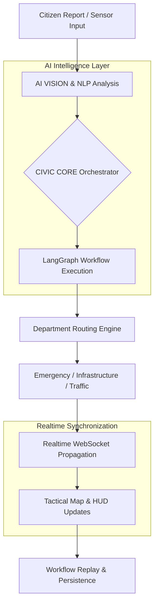

# CivicOS — Realtime AI Urban Intelligence Operating System

[](https://hackathons.withgoogle.com/)
[](https://deepmind.google/technologies/gemini/)
[](https://nextjs.org/)
[](https://fastapi.tiangolo.com/)

**CivicOS** is a production-grade, realtime AI-powered urban intelligence operating system designed to orchestrate smart city infrastructure, emergency coordination, civic incident response, and geospatial operational intelligence. Built for high-stakes urban command centers, CivicOS leverages the **Gemini AI** ecosystem and **LangGraph** orchestration to transform raw city data into actionable, autonomous civic responses.

---

## 🏗️ System Architecture

CivicOS is architected as a distributed intelligence platform, separating concerns between high-frequency telemetry, long-running AI orchestrations, and a cinematic geospatial frontend.



### **The Intelligence Pipeline**
1. **Intake**: Multi-modal data (images, text, sensor telemetry) enters the system.
2. **Analysis**: **Gemini 2.5 Flash** performs zero-shot classification and severity inference.
3. **Orchestration**: A **LangGraph** state machine determines the escalation chain and agent delegation.
4. **Propagation**: Results are streamed via **WebSockets** to all connected command consoles.
5. **Visualization**: The **Google Maps Tactical Layer** renders the operational impact in real-time.

---

## 🚀 Core Features

### **1. Realtime AI Orchestration**
Autonomous management of civic workflows using a multi-agent system. Each agent (Vision, Routing, Action) reasons about the incident and coordinates with city departments.

### **2. Geospatial Intelligence**
A premium integration of the **Google Maps JavaScript API** featuring:
- **Tactical Overlays**: Real-time incident markers and emergency perimeters.
- **Infrastructure Layers**: Live monitoring of city-wide assets (hospitals, fire stations, utility nodes).
- **Traffic Intelligence**: Dynamic congestion heatmaps and AI-driven rerouting visualization.

### **3. CIVIC CORE — AI Command Copilot**
A streaming, conversational intelligence assistant powered by **Gemini**.
- **Context-Aware**: Ingests live city telemetry, active workflows, and department loads.
- **Operational Reasoning**: Answers complex questions like *"Why is traffic overloaded in Sector 4?"* or *"Predict infrastructure risk based on current escalations."*

### **4. Workflow Replay Engine**
A cinematic "mission-style" replay system that allows commanders to review every step of an AI decision-making process, including agent logs, telemetry spikes, and execution traces.

---

## 🛠️ Tech Stack

### **Frontend (Command Console)**
- **Next.js 15 (App Router)**: For high-performance SSR and seamless routing.
- **TypeScript**: Ensuring type-safe operational data structures.
- **Tailwind CSS**: Custom cinematic HUD styling with glassmorphism.
- **Framer Motion**: Powering fluid, high-end UI transitions and micro-interactions.
- **React Flow**: Visualizing the complex AI orchestration graphs.
- **Zustand**: Lightweight, high-speed global state management for telemetry.
- **Google Maps JS API**: The primary geospatial visualization surface.

### **Backend (Intelligence Core)**
- **FastAPI (Python)**: High-performance asynchronous API framework.
- **LangGraph / LangChain**: Managing complex, multi-step AI orchestration states.
- **Gemini API**: The reasoning brain for incident analysis and conversational intelligence.
- **PostgreSQL / SQLAlchemy**: Robust persistence for city incidents and workflow history.
- **Redis**: High-speed caching and pub/sub for realtime events.
- **WebSockets**: Bi-directional streaming of system telemetry and AI events.

---

## 📸 Screenshots

| Dashboard Overview | Tactical Map |
| :--- | :--- |
|  |  |

| AI Orchestration Graph | CIVIC CORE Copilot |
| :--- | :--- |
|  |  |

---

## ⚙️ Local Development Setup

### **Prerequisites**
- Node.js 18+
- Python 3.10+
- Docker & Docker Compose (for Postgres/Redis)

### **1. Clone & Install**
```bash
git clone https://github.com/Sudhanshu41/CivicOS.git
cd CivicOS
```

### **2. Frontend Setup**
```bash
cd civicos
npm install
cp .env.example .env.local
# Add your API keys to .env.local
npm run dev
```

### **3. Backend Setup**
```bash
cd backend
python -m venv venv
source venv/bin/activate # Windows: venv\Scripts\activate
pip install -r requirements.txt
# Configure backend/.env
python main.py
```

### **Environment Variables**
| Variable | Description |
| :--- | :--- |
| `GEMINI_API_KEY` | Official Google Gemini API Key |
| `NEXT_PUBLIC_GOOGLE_MAPS_API_KEY` | Google Maps Platform Key |
| `DATABASE_URL` | PostgreSQL Connection String |
| `REDIS_URL` | Redis Instance URL |
| `NEXT_PUBLIC_WS_URL` | WebSocket Server Address |

---

## 🌍 Deployment

CivicOS is designed for cloud-native deployment on **Google Cloud Platform**:
- **Cloud Run**: Scalable containerized deployment for the FastAPI backend and Next.js frontend.
- **Cloud SQL**: Managed PostgreSQL for persistent city records.
- **Cloud Memorystore**: Managed Redis for high-frequency telemetry.
- **Firebase Hosting**: Global CDN for optimized frontend delivery.

---

## 💎 Engineering Highlights

- **Modular Orchestration**: Workflows are decoupled from the execution engine, allowing for hot-swappable AI agents.
- **Realtime Synchronization**: Uses a customized WebSocket protocol to ensure sub-100ms synchronization across all command consoles.
- **Replay-Capable Systems**: Every AI decision is immutable and stored in a temporal trace for auditability.
- **Cinematic UX**: A design language focused on "Information Density with Clarity," inspired by aerospace command interfaces.

---

## 🔮 Future Roadmap

- [ ] **Predictive AI Operations**: Moving from reactive response to proactive infrastructure prevention.
- [ ] **IoT Edge Integration**: Direct ingestion from city-wide hardware sensors and camera meshes.
- [ ] **Satellite Intelligence**: Ingesting high-resolution satellite imagery for disaster damage assessment.
- [ ] **Autonomous Dispatch**: Seamless integration with autonomous emergency vehicle fleets.

---

## 📜 License

Distributed under the MIT License. See `LICENSE` for more information.

**CivicOS** — *Orchestrating the Future of Autonomous Civic Intelligence.*
