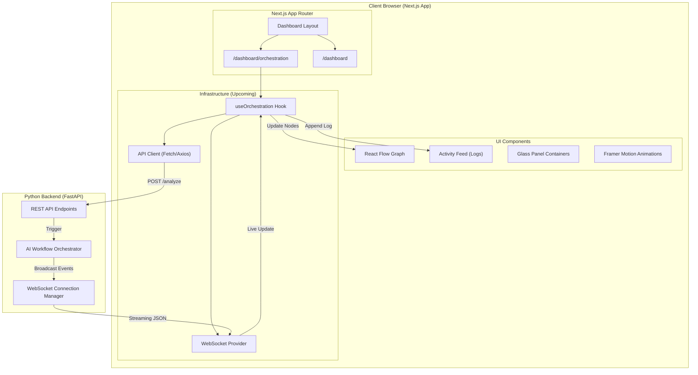

# CivicOS — Frontend Architecture Diagram

## Key Flows
1. **Trigger**: User clicks "Analyze" -> API Client sends request to Backend -> Backend returns 202.
2. **Listen**: `useOrchestration` hook establishes WebSocket connection via `SocketProvider`.
3. **Visualize**: Backend streams "node started" events -> Hook updates React Flow node status -> Framer Motion triggers glow/pulse animations.
4. **Log**: Backend streams "log" events -> Hook appends to `ActivityFeed` state -> UI renders new log line with slide-up animation.
